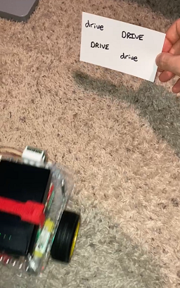

## Overview
The main work is in `camera_loop.py`. This code runs on a GoPiGo Rasperry Pi robot and will move, turn, or stop based on text it sees.

[Demo](demo/example.mp4)




Old stuff: ball tracking based on [this](https://pyimagesearch.com/2015/09/14/ball-tracking-with-opencv/) blog post.


## Anaconda and Pip
```
conda create --name guthbot_env python=3.7.3 -y
conda activate guthbot_env
pip install -r requirements.txt
```

Pytesseract:
- https://tesseract-ocr.github.io/tessdoc/Installation.html
- https://github.com/UB-Mannheim/tesseract/wiki